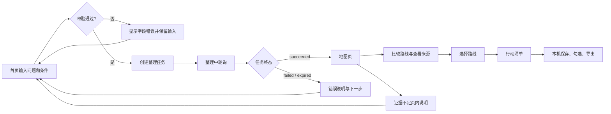

# 知乎经验地图｜用户流程说明

> 版本：v1.0  
> 日期：2026-09-13  
> 负责人：成员一  
> 关联文档：[PRD](./prd.md)、《知乎经验地图｜产品与工程执行规范》v1.0.0  
> 状态：产品流程基线，待成员二、三评审；不代表页面或接口已经实现。

## 1. 流程目标

本流程服务于这样的用户：在知乎提出决策型问题、看过多个回答，却仍然无法结合自己的条件比较利弊并开始行动。

用户完成一次流程后，应能：

1. 说明自己正在解决的问题和已提供的条件。
2. 看懂 1–3 条有来源支撑的参考路线及其差异。
3. 从路线中的行动定位到知乎摘要和原文链接。
4. 自主选择一条路线，得到可执行、可勾选的任务清单。

流程不替用户宣布唯一正确答案。路线数量由证据决定，证据不足时明确说明缺失，不生成无依据的路线。

## 2. 主流程总览

### 2.1 页面和接口对应

| 页面 | 地址 | 主要用户动作 | 主要接口 |
|---|---|---|---|
| 首页 | `/` | 输入主题或问题链接、补充条件、提交或打开案例 | `POST /api/v1/maps/jobs`（提交时） |
| 整理中 | `/jobs/:jobId` | 查看阶段状态、等待、重试或返回修改 | `GET /api/v1/maps/jobs/:jobId` |
| 经验地图 | `/maps/:mapId` | 比较路线、展开阶段、查看引用、选择路线 | `GET /api/v1/maps/:mapId` |
| 行动清单 | `/maps/:mapId/plan?routeId=...` | 勾选任务、保存、导出、返回地图 | 无新增模型请求；使用已有地图快照 |

## 3. 首页流程 `/`

### 3.1 首次进入

页面先说明产品名称、口号和价值：将零散的知乎经验整理为可比较、有出处的参考路线。默认选中“主题输入”。用户可以切换到“知乎问题链接”。

页面提供两个示例入口：

- **填入实习示例**：填入“大学生如何准备第一份产品经理实习？”及零实习、8 周、每周 10 小时、500 元预算，只改变表单，不创建任务。
- **查看已整理案例**：进入标记为“演示案例”的回放流程，不调用知乎或模型。

### 3.2 主题输入模式

1. 用户输入自然语言主题。
2. 用户可展开“补充我的条件”，填写背景、准备周数、每周小时数和人民币预算。
3. 用户点击“生成经验地图”。
4. 前端校验必填项和格式；失败时在对应字段旁显示原因，保留所有输入。
5. 校验通过后生成本次请求的 `Idempotency-Key`，提交 `POST /api/v1/maps/jobs`。
6. 收到 `202` 与 `jobId` 后立即禁用提交按钮，跳转 `/jobs/:jobId`。

主题模式请求中 `query` 必填，`questionUrl` 为 null；条件空值表示未指定，预算 `0` 表示真实的零预算条件。

### 3.3 问题链接模式

1. 用户切换到“知乎问题链接”。
2. 用户粘贴完整的知乎问题 URL，并可填写“重点关注什么”。
3. 用户可以继续补充背景、周期、每周时间和预算。
4. 用户提交后，前端校验 URL 是否符合规范；不接受任意网页 URL。
5. 校验通过后按同一请求流程创建任务并进入整理页。

链接模式请求中 `questionUrl` 必填，`query` 可以为空。若用户在主题框直接粘贴知乎 URL，页面提示“这看起来是知乎问题链接，是否切换到问题链接模式？”，不静默改变输入含义。

### 3.4 首页状态和离开页面

| 状态 | 页面行为 |
|---|---|
| 未填写 | 提交按钮可见，说明必填项 |
| 校验失败 | 字段级错误，输入不丢失 |
| 正在提交 | 提交按钮禁用，避免重复创建 |
| 创建成功 | 跳转整理页 |
| 创建失败 | 展示统一错误文案；若服务端返回可重试，允许沿用同一请求意图重试 |
| 点击查看案例 | 进入 replay，页面显式标记“演示案例” |

用户离开首页不会保存未提交表单，除非浏览器自身保留输入；已创建的任务以 `jobId` 为准恢复。

## 4. 整理中流程 `/jobs/:jobId`

### 4.1 状态展示

前端每 1500ms 请求一次任务状态。只展示服务端返回的固定阶段文案：

| 状态值 | 页面文案 | 用户理解 |
|---|---|---|
| `queued` | 排队中 | 请求已接收，等待处理 |
| `retrieving` | 查找知乎内容 | 正在获取可用摘要 |
| `organizing` | 整理经验路线 | 正在按条件组织路线 |
| `validating` | 检查来源 | 正在核对引用和来源 |
| `succeeded` | 整理完成 | 即将进入经验地图 |
| `failed` | 整理失败 | 依据错误信息决定下一步 |
| `expired` | 整理已过期 | 需要重新发起整理 |

页面可显示用户本次的问题和条件。不得显示虚构的百分比、阅读数量、已分析回答数量或模型内部推理。

### 4.2 成功分支

1. 收到 `status=succeeded` 且 `mapId` 非空。
2. 停止轮询。
3. 跳转 `/maps/:mapId`。
4. 地图页以 `mapId` 获取不可变快照。

未知状态、成功但缺少 `mapId` 或响应不符合契约时，不得当作成功；应显示暂时无法确认结果的错误状态。

### 4.3 失败、过期和中断

- `failed`：展示统一错误结构中的用户可读 `message`。只有 `retryable=true` 时显示“重试”；重试沿用同一次用户请求的幂等意图，不能因重复点击创建多个上游任务。
- `expired`：保留可恢复的输入摘要，提供“返回修改”或重新整理。
- 95 秒仍未进入终态：显示“连接中断，请稍后查看或使用演示案例”，停止自动轮询；不声称服务端任务已经取消或失败。
- 用户返回或切换路由：清理当前页面轮询。服务端任务可以继续运行，重新进入相同 `jobId` 时继续查询。
- 浏览器刷新：从地址栏的 `jobId` 恢复查询，不重新创建任务。

## 5. 地图页流程 `/maps/:mapId`

### 5.1 首次进入

页面按以下顺序呈现：

1. 问题与用户条件。
2. 数据状态：实时整理、缓存结果、演示案例或合成测试数据。
3. 概览：说明本次主要选择和取舍。
4. 路线卡片与统一比较维度。
5. 当前路线的阶段和任务。
6. 有证据的观点差异。
7. 来源入口。
8. 行动清单入口。

地图是不可变快照。刷新只重新读取同一个 `mapId`，不重新调用模型，也不改变路线内容。

### 5.2 路线比较

当有 2–3 条路线时：

1. 默认展开第一条路线，但不标记“最优”或“系统推荐”。
2. 用户可以查看每条路线的名称、核心策略、适用条件、时间、预算、每周投入、风险、阶段和引用。
3. 用户在同一组维度下比较路线。
4. 用户展开观点差异，看到差异对应的证据编号。
5. 用户可随时切换展开项；此操作不产生新的模型请求。

当只有 1 条路线时，隐藏没有意义的比较切换，保留路线、证据和局限说明。

当没有合格路线时：

- 展示已有来源（如果存在）和“证据不足”的原因。
- 说明缺少什么信息或支撑。
- 提供“返回修改问题”与“查看演示案例”。
- 不展示空卡片、不虚构第二条路线、不生成无依据的行动清单。

### 5.3 查看来源

用户点击路线、阶段或任务旁的引用编号后，打开对应来源抽屉：

1. 抽屉显示内容类型、可用标题、作者（若返回）、摘要、引用片段和获取时间。
2. 用户可点击“查看知乎原文”，在新标签打开官方 URL。
3. 用户关闭抽屉后回到触发引用的原位置。
4. 桌面端使用右侧抽屉，移动端使用全屏弹层。
5. 键盘用户可用 Tab 进入、Esc 关闭；焦点限制在抽屉内，关闭后恢复到触发控件。

作者或标题缺失时，页面如实显示“作者信息未返回”，或使用“该问题下的回答摘要”作为界面标签，不猜测原始信息。

### 5.4 选择路线

1. 用户点击某条路线的“选择这条路线”。
2. 页面记录 `mapId` 与 `routeId`，不重新请求 AI。
3. 跳转 `/maps/:mapId/plan?routeId=...`。
4. 若 `routeId` 不存在或不属于该地图，显示无效路线错误并返回地图，不渲染其他路线的任务。

## 6. 行动清单流程 `/maps/:mapId/plan?routeId=...`

### 6.1 进入清单

清单复用所选路线已有的阶段和任务，展示：路线名称、问题和条件、建议安排、任务动作、完成判据、引用和当前完成状态。“第几周”显示为“建议安排”，不是来源保证的时间承诺。

进入清单不触发新的内容整理或模型请求。

### 6.2 勾选和保存

1. 用户勾选或取消一个任务。
2. 页面更新完成状态，并写入本机存储键 `experience-map:plan:v1:{mapId}:{routeId}`。
3. 保存内容包含 `schemaVersion`、路线标识、已完成 `taskId` 集合和 `updatedAt`。
4. 不保存密钥、知乎账号信息或无关敏感资料。
5. 刷新页面后按同一 `mapId` 与 `routeId` 恢复状态。
6. 不同地图或不同路线的状态互不覆盖；清楚说明不跨设备同步。

若本机存储失败，页面提示进度可能未保存，但仍保持任务列表可操作，并提供导出。

### 6.3 导出和返回

导出的 Markdown 至少包含：

- 问题和用户条件；
- 所选路线及其策略；
- 每个阶段、任务、完成判据和勾选状态；
- 相关来源链接；
- 生成时间；
- 实时、缓存、演示案例或合成测试数据标记。

用户可以返回地图比较其他路线。返回不会删除当前本机清单状态，再次进入同一 `routeId` 时继续恢复。

## 7. 异常分支和恢复路径

| 场景 | 触发位置 | 用户看到的内容 | 恢复动作 |
|---|---|---|---|
| 主题为空或格式错误 | 首页 | 字段错误 | 修改后重试 |
| 问题 URL 不合法 | 首页 | 说明仅支持知乎问题 URL | 修改链接或切回主题模式 |
| 重复提交 | 首页 | 按钮禁用或返回同一 job | 继续查看原任务 |
| 上游认证失败 | 整理中/错误 | 服务暂不可用，不暴露凭证细节 | 查看演示案例或稍后重试（按 retryable） |
| 达到调用限制 | 整理中/错误 | 已达到内容服务调用限制 | 停止自动重试，查看演示案例 |
| 上游超时 | 整理中/错误 | 请求超时 | 按 retryable 决定是否重试 |
| 没有可用内容 | 地图/错误 | 没找到足够摘要 | 修改问题或查看回放 |
| 证据不足 | 地图 | 有哪些来源、缺少什么支撑 | 不选择无依据路线，返回修改 |
| 模型输出不合法 | 整理中/错误 | 暂未得到可靠路线 | 不渲染非法地图，按服务端指示重试 |
| 地图不存在或无效 | 地图 | 结果不可用 | 返回首页或查看案例 |
| 本机保存失败 | 清单 | 当前进度可能未保存 | 继续操作并导出文件 |

错误信息只展示统一错误结构的用户可读内容，不展示堆栈、URL、Secret、内部推理或未核实的上游细节。

## 8. 回放、缓存与实时流程

三种流程的页面结构相同，但状态标签不同：

| 模式 | 进入方式 | 页面标签 | 网络行为 |
|---|---|---|---|
| 实时整理 | 首页提交 `dataMode=live` | 实时整理 | 创建任务并调用服务端上游能力 |
| 缓存结果 | 命中历史快照 | 缓存结果 | 读取已有地图，不新增上游调用 |
| 演示回放 | 点击“查看已整理案例”或选择回放 | 演示案例 | 只读预置结果，不调用知乎或模型 |

Mock 固定标记为“合成测试数据”。回放内容必须有人工核验记录，现场断网前应完整演练从入口到来源和清单导出的路径。

## 9. 用户流程验收清单

- [ ] 用户能从首页用主题输入完成一次整理。
- [ ] 用户能用知乎问题链接完成一次整理。
- [ ] 主题、链接、空条件和预算 0 的含义正确。
- [ ] 重复点击不会创建多个任务，刷新可恢复原 `jobId`。
- [ ] 整理页显示四个固定阶段，95 秒未完成时停止轮询并诚实提示。
- [ ] 成功、无结果、证据不足、限流、超时、失败和过期均有明确恢复路径。
- [ ] 地图页能比较 1–3 条路线，路线数量不足时不编造。
- [ ] 引用抽屉能从任务定位到摘要和知乎原文，支持 Esc 和焦点恢复。
- [ ] 选择路线后不新增模型请求，清单任务与 `routeId` 一致。
- [ ] 清单勾选刷新后保留，地图和路线之间状态隔离。
- [ ] Markdown 导出包含条件、任务状态、来源和数据状态。
- [ ] 实时、缓存、演示和 Mock 标记准确，断网回放可完成主流程。
- [ ] 360、390、768、1440px 无整页横向溢出，键盘可完成关键操作。

## 10. 待评审问题

以下问题不阻塞本流程文档使用，但需要在联调前确定：

1. 成员二 contracts 对输入长度、数字范围和错误码的最终约束。
2. 证据不足时“已有来源”在地图页的具体布局。
3. 回放案例的入口 URL、启动命令和断网演练环境。
4. 用户返回修改时是否保留全部表单字段，以及浏览器刷新后的恢复范围。
5. 成员一完成主、备用案例的人工核验后，更新地图和清单中的最终示例文案。

这些事项如需要新增字段或改变接口，先记录 ADR，并由成员二和受影响成员评审。

## 11. 修订记录

| 日期 | 版本 | 内容 |
|---|---|---|
| 2026-09-13 | v1.0 | 根据 PRD 与技术规范建立主流程、异常分支、页面跳转、状态恢复和回放规则 |
